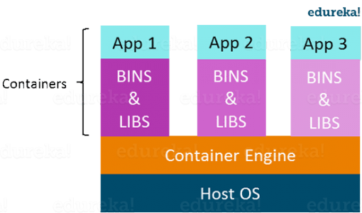

# DOCKER NOTES
## Index
- [Why Docker?](#why-docker)
- [What is virtualization?](#what-is-virtualization)
- [What is Containerization?](#what-is-containerization)
- [Namespacing in OS:](#namespacing-in-os)
- [Control Groups in OS:](#control-groups-in-os)
- [Docker Container vs Images](#docker-container-vs-images)
- [Docker command structure](#docker-command-structure)
- [Docker Beginner-1 Commands: Creating and Running Pre-Built Docker Images](#docker-beginner-1-commands-creating-and-running-pre-built-docker-images)
   1. [docker run](#docker-run)
   2. [docker ps](#docker-ps)
   3. [docker create](#docker-create)
   4. [docker start](#docker-start)
- [Docker Hub and Image Cache.](#docker-hub-and-image-cache)
- [Lifecycle of a container - Restarting a stopped container.](#lifecycle-of-a-container---restarting-a-stopped-container)
- [Docker Beginner-2 Commands:](#docker-beginner-2-commands)
   1. [docker system prune](#docker-system-prune)
   2. [docker log](#docker-log)
   3. [docker stop](#docker-stop)
   4. [docker kill](#docker-kill)
   5. [docker exec](#docker-exec)
   6. [Open a Shell](#docker-open-shell)
- [Purpose of '-i' and '-t'.](#purpose-of--i-and--t)
- [Containers are Isolated unless programmed to communicate.](#containers-are-isolated-unless-programmed-to-communicate)
- [What is a Dockerfile?](#what-is-a-dockerfile)
- [What does Dockerfile Generally Include?](#what-does-dockerfile-generally-include)
- [Docker Intermedite-1 Commands: Creating your own Docker Images](#docker-intermediate-1-commands-creating-your-own-docker-images)
- [Dockerfile Explained:](#dockerfile-explained)

## Why Docker?
Docker is generally used to completely deploy and run any application with ease. Where it takes several steps to install a particular program (like redis) on any machine, docker does this with one simple command. Docker helps to build, ship and run application complete with all the dependencies. 

## What is Virtualization?
Virtualization is the technique of importing a Guest operating system on top of a Host operating system. It allows developers to run multiple OS in different Virtual Machines on the same host (PC).

\
*Source: [https://www.edureka.co/blog/docker-tutorial](https://www.edureka.co/blog/docker-tutorial)*

Guest OS runs on a virtual layer called *hypervisor*, that enables Host OS to support multiple OS.

### Disadvantages of virtualization:
1. Performance degradation: Virtual host having it's own set of libraries and dependencies takes up a lot of resources.
2. Booting up a VM takes time: Having a VM is like installing an OS, it takes time to setup.
3. Hypervisors are slow.

## What is Containerization?
Containerization is similar to virtualization minus the drawbacks. Containerization brings abstraction to the OS level, instead of hardware level (like virtualization). Containers run on the host OS itself instead of having it's own guest OS. 
Docker is based on containerization.

\
*Source: [https://www.edureka.co/blog/docker-tutorial](https://www.edureka.co/blog/docker-tutorial)*

Containers run on a virtual layer called *Container Engine*, that enables host OS to support running containers.

### Advantages of containerization:
1. Containers are light weight: It uses the relevant resources and libraries from the host OS, thus they are lighter than the complete OS that virtualization uses.
2. Booting up a container takes a few seconds

## Namespacing in OS: 
Consider an hypothetical situation where, two programs *Chrome* and *NodeJS* on same Operating System requires *python2* and *python3* respectively. And suppose only *python2* is installed, *Chrome* would run without any issues but *NodeJS* would fail. Namespacing solves this issue by segmenting the resources into segments each with respective softwares installed or certain resource access.

## Control Groups in OS:
Similar to namespacing, but it is used to *limit* Memory, CPU Usage, Hardisk I/O and N/W Bandwith. So a particular process could be allocated a specific amount of resource beyond which it cannot use.  

## Docker Container vs Images

## Docker command structure
- old (still works): docker <command> (options)
- new: docker <command> <sub-command> (options)

## Docker Beginner-1 Commands: Creating and Running Pre-Built Docker Images
1. <a name='docker-run'/> **docker run <image_name>** _**(Creating and Running a Container)**_\
`docker run hello-world` - 'hello-world' is a test image that echoes a message and exits.
`docker run busybox echo hello world` - Command echos the hello world message and immediately exits.  
`docker run hello-world echo hello world` - This command FAILS because hello-world container does not have echo command installed, infact it does not have anything installed it just prints a message.  

2. <a name='docker-ps'/> **docker ps** _**(List Containers)**_\
`docker ps` - Initially it wont show up anything since there is no container running in the background  
`docker run busybox ping google.com` - This will keep pinging google.com thus keep the terminal alive, now running 'docker ps' should return a running container  
`docker ps --all` - Lists all the containers that was ever run  

**DOCKER RUN = DOCKER CREATE + DOCKER START**  

3. <a name='docker-create'/> **docker create <image_name>** _**(Creates a ready to run container and returns the created container's ID)**_\
`docker create hello-world` - It will return the created container's ID  

4. <a name='docker-start'/> **docker start <created_container_id>** _**(Starts the provided container_id)**_\
`docker start -a <container_id>` - \-a symbolize to "attach" the container to current terminal thus the o/p is displayed  
`docker start <container_id>` - Starts the container but doesn't attach the o/p to current terminal  

## Docker Hub and Image Cache.  
When any image is 'run', it is searched for in the local "Image Cache". If not found it'll be downloaded (pulled) from the "Docker Hub" to local "Image Cache". The next time same image is referenced, it'll skip the downloading and directly 'run' the downloaded image from "Image Cache".  

## Lifecycle of a container - Restarting a stopped container.  
On running `docker ps --all`, all the previous running container will be listed. The listed containers will be mostly in EXITED (0) state. To **restart** the EXITED container you just need to run `docker start -a 'container_id_of_the_exited_container'`. This will restart the container with the command that was previously issued. The command passed during container creation cannot be modified during restarting of that container.

## Docker Beginner-2 Commands:  
1. **docker system prune** _**(Completely removes all stopped containers, all networks not used by at least one container, all dangling images and all build image cache)**_ <a name='docker-system-prune'/>\
`docker system prune` - Since this deletes downloaded image cache aswell the next time you try to run or create a container it'll pull the image from docker hub.  

2. **docker logs** _**(Prints the logs/output generated of the running (up) or exited container)**_ <a name='docker-log'/>\
`docker logs <container_id>`  

3. **docker stop** _**(Issues a h/w signal 'SIGTERM' to process, similar to "ctrl+c". process will have some time to stop on it's own.)**_ <a name='docker-stop'/>\
`docker stop <container_id>` - If a process doesn't respond to 'SIGTERM' command it'll be killed automatically in 10 seconds.  

4. **docker kill** _**(Issues a h/w signal 'SIGKILL' to process which instantly kills the process)**_ <a name='docker-kill'/>\
`docker kill <container_id>` - It is safer to use stop instead of kill  

5. **docker exec** _**(Execute a command within another container)**_ <a name='docker-exec'/>\
`docker run redis` Runs a redis-server within the container.	  
`docker exec -it <container_id> <command>"` Executes the "command" within the container provided. "-it" flag is required to get the control back to current terminal.  
`docker exec -it <running_redis_container_id> redis-cli` It'll run the command "redis-cli" inside "redis" container. (Info: redis-cli is the command to run redis queries directly on 'redis-server').

6. **Open a Shell** _**(access the terminal of the container)**_ <a name='docker-open-shell'/>\
`docker exec -it <running_container_id> sh` 'sh' is nothing but shell program (command processor), instead 'bash' or 'zsh' could also be used.   
`docker run -it <image_name> sh` Very similar to exec, except this container won't execute the default command it was programmed with (e.g: redis server won't start with this command but you'll be directly redirected to shell).  

## Purpose of '-i' and '-t'.  
Every process has 3 ways to communicate with underlying architecture - STDIN, STDOUT and STDERR  
   * \-i = connects the current terminal to containers STDIN  
   * \-t = emulates the terminal so that rsults would be formatted and displayed as it will be displayed in the original cli  

## Containers are Isolated unless programmed to communicate.  
`docker run -it busybox sh` Running this command on two different terminals create two running containers of "busybox" which is mutually exclusive, resources is by default not shared between two. 

## What is a Dockerfile?  
It contains all the configurations to build an image that defines a container behaviour. *Dockerfile* -> Docker Client -> Docker Server -> *Docker Image*. We pass the "Dockerfile" to "Docker Client", "Docker Client" submits the "Dockerfile" to "Docker Server". "Docker Server" reads the Dockerfile and creates the "Docker Image".

## What does Dockerfile Generally Include?
1. **Base Image** : OS on which any program needs to be installed is mentioned here.  
2. **Commands to Install Additional Programs** : Any additional commands to run once the OS has been installed is mentioned here.  
3. **Command to Run on Container Startup** : Command to run on container startup is mentioned here.  

## Docker Intermediate-1 Commands: Creating your own Docker Images  
1. **docker build**  
   * Create a folder with a relevant name (e.g: redis-server).
   * Inside the folder create a file named "Dockerfile", without any extension.
   * Populate docker file with following commands (w/o tab):
	```
	FROM alpine
	RUN apk add --update redis
	CMD \["redis-server"\]
	```
   * Save and Exit.
   * Open terminal and run
	`docker build 'folder_path'`
   * Once the operation finishes it will return a Image ID. This could then be used to create containers. 
	`docker run 'image_id'`

## Dockerfile Explained:
Docker file consists of two parts: **COMMAND arguments**  
1. **FROM alpine** : OS on which any program needs to be installed is mentioned here. Alpine linux is used as the base image (OS) to install redis software on.
2. **RUN apk add --update redis** : Any additional commands to run once the OS has been installed is mentioned here. We use "apk", a default package manager provided with Alpine, to install redis.
3. **CMD ["redis-server"]** : Command to run on container startup is mentioned here. "redis-server" command starts up the redis server.

